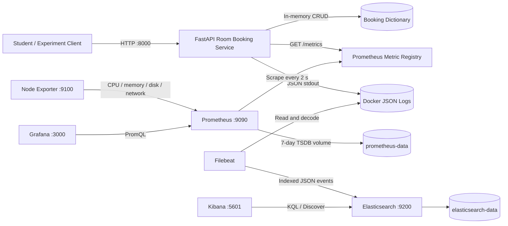

# Assignment 1: Observability

> Complete the highlighted evidence fields after running the experiments. Do
> not submit predicted values as measured results.

## Part A — Project

### Problem and users

Campus students need a simple way to reserve study rooms, while campus staff
need to see whether the service is healthy and whether bookings succeed. A
failure can be technical, such as a slow HTTP request, or business-related,
such as attempts to reserve an already occupied room.

### Solution

The project is a FastAPI room-booking service. A user can create, list, and
cancel bookings. The application rejects duplicate active bookings for the
same room. Bookings are held in memory to keep the business application small;
the assignment focuses on the surrounding observability system rather than
database implementation.

The API is available through Swagger at `http://localhost:8000/docs`. The
complete environment starts with `docker compose up -d --build`. Usage,
experiments, and safe cleanup are documented in `README.md`.

### What works

- Create, list, and cancel bookings.
- Validate room names and durations from 15 to 180 minutes.
- Reject an already occupied room with HTTP 409.
- Add or propagate an `X-Request-ID` for every request.
- Emit application and business metrics.
- Emit structured JSON request and business-event logs.
- Inject a controlled 500 ms delay into every fifth create request.
- Run a bounded 100-ID cardinality demonstration.

## Part B — Metrics

Prometheus scrapes the application, Node Exporter, and Prometheus itself every
two seconds. Prometheus data persists in the `prometheus-data` volume for seven
days. Grafana reads Prometheus through its Docker-network address,
`http://prometheus:9090`.

### Application and business metrics

| Metric | Purpose | Type | Unit | Labels | Recorded in code | Grafana query / meaning |
|---|---|---|---|---|---|---|
| `room_booking_http_requests_total` | Count HTTP requests and failures | Counter | requests | `method`, `route`, `status` | `observe_request` middleware after each request | `sum by (status) (rate(room_booking_http_requests_total{route!~"/metrics\|/health"}[1m]))`; recent requests per second by HTTP status |
| `room_booking_http_request_duration_seconds` | Measure request latency and tail behavior | Histogram | seconds | `method`, `route`, `le` | `observe_request` calls `observe(duration)` | `histogram_quantile(0.95, sum by (le) (rate(room_booking_http_request_duration_seconds_bucket{route="/bookings",method="POST"}[5m])))`; estimated POST p95 over the last five minutes |
| `room_booking_events_total` | Count business actions and outcomes | Counter | events | `action`, `result` | Create/cancel endpoints | `sum by (action, result) (room_booking_events_total)`; cumulative successful and rejected business actions |
| `room_booking_active_bookings` | Show current outstanding bookings | Gauge | bookings | none | Incremented after creation and decremented after cancellation | `room_booking_active_bookings`; current active bookings |
| `room_booking_validation_duration_seconds` | Measure time spent checking booking rules | Summary | seconds | none | Create endpoint around the room-availability check | `room_booking_validation_duration_seconds_sum / clamp_min(room_booking_validation_duration_seconds_count, 1)`; average validation duration since process start |
| `demo_requests_total` | Demonstrate cardinality cost safely | Counter | requests | `request_id` only in unsafe mode | `/demo/cardinality` | `count(demo_requests_total)`; current number of series |

Python's Prometheus client Summary does not calculate configurable quantiles.
Therefore, the dashboard reports the Summary's average using `_sum / _count`
and obtains p95 from the Histogram. The p95 chart uses a five-minute `rate()`
window: each point estimates the duration at or below which 95% of POST booking
requests fell during the preceding five minutes. It is an estimate derived
from bucket boundaries, not an exact sorted percentile.

### Explored chart

The dashboard includes a self-explored **Booking Rejection Rate** chart:

```promql
100 *
(sum(rate(room_booking_events_total{result="rejected"}[5m])) or vector(0))
/
clamp_min(
  (sum(rate(room_booking_events_total[5m])) or vector(0)),
  0.000001
)
```

This converts business outcomes into a percentage. It distinguishes a healthy
API that is rejecting invalid business operations from a technically failing
API. A high rejection percentage can indicate users repeatedly selecting
occupied rooms even when HTTP latency and infrastructure utilization are low.

### Machine metrics

Node Exporter measures the machine named **Docker Desktop Linux VM**. It does
not represent the complete Windows host.

| Resource | Query | Interpretation |
|---|---|---|
| CPU | `100 * (1 - avg(rate(node_cpu_seconds_total{job="node-exporter",mode="idle"}[5m])))` | Percentage of non-idle CPU over five minutes |
| Memory | `100 * (1 - node_memory_MemAvailable_bytes{job="node-exporter"} / node_memory_MemTotal_bytes{job="node-exporter"})` | Percentage of memory not currently available |
| Disk | `100 * (1 - node_filesystem_avail_bytes{job="node-exporter",mountpoint="/var/lib"} / node_filesystem_size_bytes{job="node-exporter",mountpoint="/var/lib"})` | Used percentage of Docker Desktop's data filesystem |
| Network receive | `sum(rate(node_network_receive_bytes_total{job="node-exporter",device!="lo"}[5m]))` | Received bytes per second excluding loopback |
| Network transmit | `sum(rate(node_network_transmit_bytes_total{job="node-exporter",device!="lo"}[5m]))` | Sent bytes per second excluding loopback |

The versioned dashboard is
`monitoring/grafana/dashboards/room-booking-observability.json`.

**Evidence to insert:** `evidence/grafana-normal.png` and
`evidence/prometheus-targets.png`.

## Part C — Logs

### Events and fields

The service logs both request completions and business events. Request logs are
useful for latency, status, and correlation. Business logs explain why a
booking was created, cancelled, or rejected. Fault-configuration and
cardinality-demo events make experiments auditable.

Every relevant event contains:

- `@timestamp`
- `service.name`
- `log.level` and `severity`
- `message`
- `request_id`
- event-specific fields such as `method`, `route`, `status`, `duration_ms`,
  `event_type`, `booking_id`, or `reason`

The application does not log secrets or personal information. Room identifiers
and generated booking/request IDs are operational values used by this local
demonstration.

Example format produced by `write_log`:

```json
{
  "@timestamp": "<UTC timestamp>",
  "service": {"name": "room-booking-api"},
  "log": {"level": "info"},
  "severity": "INFO",
  "message": "request completed",
  "request_id": "<UUID>",
  "method": "POST",
  "route": "/bookings",
  "status": 201,
  "duration_ms": 4.2
}
```

Replace this example in the final report with one original event copied from
Kibana.

### Collection and parsing

1. `write_log` serializes a Python dictionary as one JSON line on stdout.
2. Docker's `json-file` driver wraps and stores container stdout.
3. Filebeat Docker autodiscovery selects the application because it has the
   label `co.elastic.logs/enabled=true`.
4. Filebeat's container parser removes Docker's envelope.
5. `decode_json_fields` expands the application JSON into searchable fields.
6. Filebeat writes the event to `room-booking-logs-YYYY.MM.DD`.
7. Kibana's `room-booking-logs-*` data view makes the fields searchable.

### Storage, restart behavior, and deletion

Docker rotates the immediate container logs at three files of 10 MB each.
Filebeat's registry is stored in the `filebeat-data` named volume, so it
remembers its read location after a normal restart. Elasticsearch indices live
in the `elasticsearch-data` named volume and also survive container restarts.
This local classroom configuration has no automatic Elasticsearch deletion;
indices remain until the volume is deliberately removed with
`docker compose down -v`. Production would use an authenticated cluster and an
index lifecycle retention policy.

### Searches

```text
service.name: "room-booking-api"
```

```text
service.name: "room-booking-api" and log.level: "warning"
```

```text
event_type: "booking_rejected"
```

```text
request_id: "<copied request ID>"
```

**Evidence to insert:** one original JSON line, its parsed Kibana fields, and
screenshots `evidence/kibana-request-search.png` and
`evidence/kibana-error-search.png`.

## Part D — System Design

### Architecture diagram



All components share the Compose network. Only browser-facing ports are
published to the host. Named volumes separate persistent monitoring data from
replaceable containers.

### Failure behavior

| Failed component | Effect |
|---|---|
| Booking API | Users cannot create bookings; Prometheus reports its target down; old metrics and indexed logs remain available |
| Prometheus | New metrics are not stored and Grafana metric panels stop updating; the API and logging pipeline continue |
| Grafana | Visualization is unavailable, but Prometheus continues collecting data |
| Node Exporter | Application metrics continue; infrastructure panels stop receiving new samples |
| Filebeat | Application continues and Docker buffers a limited amount of logs; shipping resumes from the saved registry if logs have not rotated away |
| Elasticsearch | Filebeat cannot index new events; Kibana searches fail; API and metrics continue |
| Kibana | Log search UI is unavailable, but Elasticsearch can continue storing events |

### Following one metric

For a successful create request, `create_booking` calls
`ACTIVE_BOOKINGS.inc()`. The Prometheus Python client exposes the new gauge at
`/metrics` as `room_booking_active_bookings`. Prometheus requests that endpoint
within two seconds and writes the timestamped sample to its TSDB. Grafana runs
the PromQL query `room_booking_active_bookings`, reduces the result to its last
non-null value, and displays it in the Active Bookings panel.

Record one observed sequence after testing:

```text
Before create: [fill]
After create:  [fill]
Prometheus scrape time: [fill]
Grafana displayed value: [fill]
```

### Following one log

The request middleware creates or propagates a request ID. `create_booking`
passes that ID and booking fields to `write_log`, which produces JSON stdout.
Docker wraps the line in its container log format. Filebeat removes that
envelope, decodes the inner JSON, adds Docker metadata, and sends the event to
Elasticsearch. Elasticsearch stores it in the current daily
`room-booking-logs-YYYY.MM.DD` index. Kibana retrieves it using
`request_id: "<ID>"`.

Record one actual request ID, original line, index name, and Kibana result after
testing.

### Known limitations

- Bookings disappear on API restart because there is no database.
- This is a local classroom stack with Elasticsearch security disabled.
- Node Exporter observes Docker Desktop's Linux VM rather than all Windows host
  resources.
- Elasticsearch indices have no automatic retention policy in this local
  configuration.

## Part E — Experiments

### 1. Slow-request anomaly

#### Repeatable method

```powershell
python experiments\anomaly_experiment.py --requests-per-stage 30 --interval 0.5
```

Prometheus scrapes every two seconds. Each stage lasts at least 15 seconds plus
request execution time, so each contains several scrapes. The stages use the
same number of booking requests:

1. Baseline with the fault disabled.
2. Fault with a 500 ms delay on every fifth create request.
3. Recovery after disabling the fault.

#### Prediction

- The POST p95 Histogram panel will rise during the fault stage.
- The Summary average for validation should remain approximately stable because
  the delay is injected before the measured validation block.
- Request throughput may decrease because the client waits for responses.
- Structured request logs for delayed requests will have larger `duration_ms`.
- HTTP success counts should remain similar because the injected problem adds
  latency rather than an error.

#### Measured results

The client writes exact results to `evidence/anomaly-results.json`.

| Stage | Client p95 | Grafana p95 | Status results | User effect |
|---|---:|---:|---|---|
| Baseline | **[fill]** | **[fill]** | **[fill]** | Normal booking response |
| Slow fault | **[fill]** | **[fill]** | **[fill]** | Every fifth create visibly slower |
| Recovery | **[fill]** | **[fill]** | **[fill]** | Latency returns toward baseline |

Explain any difference between client p95 and Grafana p95: the client computes
an exact nearest-rank percentile over one stage, while Prometheus estimates p95
from fixed histogram buckets over a rolling five-minute window.

**Evidence to insert:** `grafana-normal.png`, `grafana-slow-fault.png`,
`grafana-recovery.png`, exact stage timestamps, and a Kibana query for a slow
request.

### 2. Cardinality explosion

#### Unsafe run

```powershell
$env:CARDINALITY_MODE = "unsafe"
docker compose up -d --force-recreate room-booking-api
python experiments\cardinality_test.py --count 100
```

In unsafe mode, the metric declaration contains a `request_id` label. The
client generates exactly 100 different IDs. The query is:

```promql
count(demo_requests_total)
```

Expected current series count: 100. Observed: **[fill after run]**.

#### Safe run

```powershell
$env:CARDINALITY_MODE = "safe"
docker compose up -d --force-recreate room-booking-api
python experiments\cardinality_test.py --count 100
```

Safe mode removes the label from the counter. After another scrape, the same
100 requests update one current series. Expected current count: 1. Observed:
**[fill after run]**.

Old labelled series remain in historical Prometheus blocks until the seven-day
retention window removes them. A current instant query stops returning them
after Prometheus marks them stale, but removing the label does not immediately
delete stored history.

At larger scale, cardinality is multiplied across label values. A request ID is
effectively unbounded, so one time series per request increases TSDB memory,
index size, disk usage, and query work without helping aggregation. Request IDs
belong in logs, where they can be searched only when an individual request must
be investigated.

**Evidence to insert:** `cardinality-unsafe.png` and `cardinality-safe.png` with
the query and time visible.

## References and Assistance

- Enterprise Software Development, Lab 1: Midnight Launch, used as a reference
  for the local observability stack.
- Prometheus client, Prometheus, Grafana, Elastic, and FastAPI official project
  documentation.
- OpenAI Codex assisted with scaffolding, debugging, configuration, and report
  structure. All commands, results, and explanations must be reviewed by the
  submitting student according to course policy.
